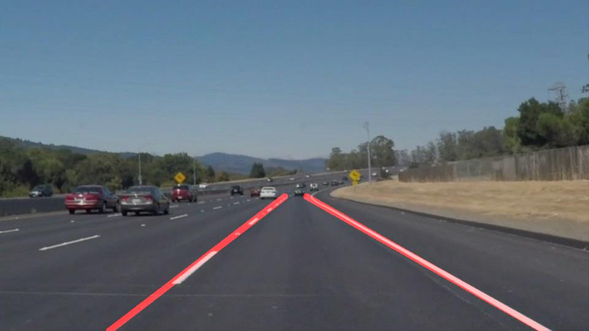

### 1. Description

Jupyter notebook Project_Finding_Lane_Lines_V1.1.ipynb contains the code to illustrate the result of each step of the lane lines detecting pipeline.  The test images are placed in find_lines/test_images/ directory. Input videos are in find_lines/test_videos/ folder. Output images, illustrating how pipeline works, and the result video with the detected lane boundaries are placed in result_image/ and result_video/ correspondingly.

### 2. Reflection

My initial image processing pipeline consisted of 6 steps:
  1. Convert image to grayscale 
  2. Apply Gaussian blur 
  3. Apply Canny edge detection 
  4. Apply polygon mask to eliminate non relevant noise 
  5. Apply probabilistic Hough transform to detect line segments 
  6. Separate the line segments into Left and Right buckets, and fit a single line to each bucket of points
    
An example result shows as follow:

This pipeline was very effective at detecting the lanes for the solidWhiteRight.mp4 and solidYellowLeft.mp4 input videos, rendering solid lines that tracked the lanes in the videos with minimal jitter. However, when I attempted to apply this processing to the challenge.mp4 video, the lane lines danced chaotically across the images.

### 2.1 Potential Pipeline Shortcomings
- Sharp curves and hills would change the angles of the lines and probably break the lane detector.

### 2.1Possible Pipeline Improvements
- Currently, the polygon mask is a fixed area, so having the polygon mask changed dynamically might also be necessary if the curves are very sharp.
